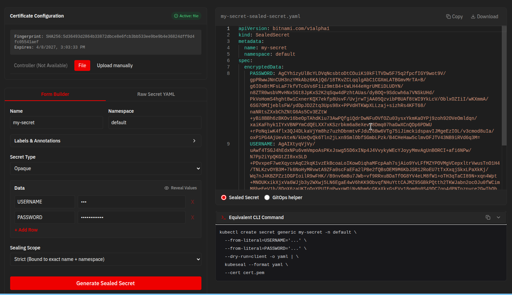

# Sealed Secret UI (`ss-ui`)


**ss-ui** is a simple application that provides a graphical interface allowing you to securely construct `SealedSecret` manifests directly through a browser UI without relying entirely on the `kubeseal` CLI.



This application guarantees completely stateless execution – no secrets are persistently logged, cached, or sent anywhere except straight out the browser.

---

## ☸️ Cluster Deployment (Helm)

The recommended way to deploy `ss-ui` to Kubernetes or OpenShift is using the provided **Helm Chart**. This handles resource creation (Deployment, Service, ServiceAccount) and automatically manages OpenShift **Routes** or standard **Ingress** based on your configuration.

### Installation

```bash
# Install the chart from the local directory
helm upgrade --install ss-ui ./charts/ss-ui \
  --namespace ss-ui --create-namespace \
  --set env.allowedOrigins="https://ss-ui.myapp.com"
```

### Configuration Reference

All configurations are managed via `values.yaml`. You can override them using `--set key=value` or by providing a custom file with `-f custom-values.yaml`.

| Parameter | Description | Default |
|-----------|-------------|---------|
| `replicaCount` | Number of pods to run | `1` |
| `image.repository` | App image repository | `quay.io/acaglio/ss-ui` |
| `image.tag` | App image tag | `latest` |
| `openshift.route.enabled` | Create an OpenShift Route | `true` |
| `openshift.route.host` | Custom domain for the Route (optional) | `""` |
| `ingress.enabled` | Create a standard K8s Ingress | `false` |
| `env.controllerNamespace` | Namespace of Sealed Secrets controller | `kube-system` |
| `env.controllerName` | Service name of Sealed Secrets controller | `sealed-secrets` |
| `env.allowedOrigins` | CORS policy for API | `*` |
| `resources.limits.memory` | Memory limit for the backend | `128Mi` |

### Advanced: Targeting a non-standard Controller

If your Bitnami Sealed Secrets controller is not in `kube-system`, simply update the environment variables via Helm:

```bash
helm upgrade --install ss-ui ./charts/ss-ui \
  --set env.controllerNamespace="custom-sealed-secrets-ns" \
  --set env.controllerName="my-controller-service"
```

---

## 🚀 How to Run Locally

You can run `ss-ui` seamlessly on your local machine using either Podman or Docker Compose. This is ideal if you want to generate Sealed Secrets without installing `kubeseal`.

### Option 1: Running with Podman (Recommended for Linux/Red Hat)

By default, the container will start fresh. You can upload any public certificate `.pem` file directly via the browser UI!

```bash
podman run -d \
  --name ss-ui \
  -p 8080:8080 \
  quay.io/acaglio/ss-ui:latest
```

**Pre-loading a Certificate offline:**
If you already pulled your cluster's public `.pem` certificate locally, you can mount it into the container so you don't have to upload it later. *(Note: The `:Z` flag guarantees SELinux allows the container backend to read it).*

```bash
podman run -d \
  --name ss-ui \
  -p 8080:8080 \
  -v $(pwd)/dev/test-cert.pem:/app/cert.pem:Z \
  -e CERT_FILE=/app/cert.pem \
  quay.io/acaglio/ss-ui:latest
```
*Navigate to [http://localhost:8080](http://localhost:8080) to access the application.*

### Option 2: Running with Podman Compose

If you use Podman Desktop or Podman Compose, we provide a pre-configured architecture.

First, create a `podman-compose.yml` file:
```yaml
version: '3.8'

services:
  ss-ui:
    image: quay.io/acaglio/ss-ui:latest
    ports:
      - "8080:8080"
    environment:
      # Optional: Maps a local certificate if mounted
      - CERT_FILE=/app/cert.pem
    volumes:
      # Optional: Mounts a public cert into the container natively
      - ./dev/test-cert.pem:/app/cert.pem
```

Launch the service in the background:
```bash
podman-compose up -d
```
*Navigate to [http://localhost:8080](http://localhost:8080) to access the application.*

---

## 🌟 Application Features & Usage

*   **Zero-State Security Model**: Secrets are instantly processed, structured, and wiped. Uploaded PEM certificates never touch the disk and live entirely in-memory.
*   **Customizable Metadata**: Add arbitrary Kubernetes labels and annotations to any secret via dynamic key-value builders in the UI.
*   **GitOps Toggle Logic**: This is the format used in the [Red Hat COP Sealed Secret Helper](https://github.com/hhellbusch/redhat-cop-helm-charts/tree/main/charts/helper-sealed-secrets) 
*   **Raw YAML Fallbacks**: Need to port over huge chunks of old code? Paste native unencrypted Kubernetes `kind: Secret` YAMLs right into the dashboard and let the frontend automatically parse and safely bridge them for you directly on the fly.

---

## 📜 Releases & Changelog

This project follows **Conventional Commits**. For a detailed history of changes and to download specific versions, please visit the [GitHub Releases](https://github.com/alessandrocaglio/ss-ui/releases) page.
